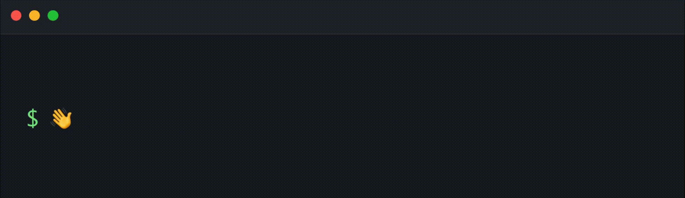

<div align="center">



Welcome to my GitHub page. I’m Daniel Selitzer, a soon to be Computer Science graduate. I enjoy learning new technologies, improving my software development skills, and turning project ideas into polished applications.

</div>

# About Me

- 🎓 Computer Science student focused on software development and building practical applications.
- 🔭 Currently working on **Collab Whiteboard**, a real-time collaborative desktop whiteboard app built with Electron, React, TypeScript, Konva, Node.js, and Socket.IO.
- 🌱 Currently learning more about real-time systems and cloud deployment.
- ⚡ Fun fact: I like exploring new places, especially when there’s good food.


# What I'm Up To


- 💻 Working with React, TypeScript, Electron, Node.js, Supabase, and Socket.IO.
- 📚 Continuing to grow as a developer.

```txt
Currently focused on:
- Collab Whiteboard: real-time collaborative desktop whiteboard
- Daily Diario: journaling web app with Supabase auth and database storage
- Aszar: Online gaming platform with server-authoritative game logic
```

# Tech Stack

## Languages


## Frameworks, Libraries , Databases & Tools


## Hosting / Deployment


# Featured Projects

## Collab Whiteboard

A real-time collaborative whiteboard desktop app built with **Electron, React, TypeScript, Konva, Node.js, and Socket.IO**.

- Built a macOS desktop app with local editing and real-time collaborative room support
- Implemented room-based syncing for drawings, sticky notes, text boxes, shapes, board titles, and clear-board actions
- Added live multi-user cursors, presence indicators, and user-colored collaboration states
- Designed reconnect recovery so users can silently rejoin rooms and reload the latest board state
- Developed local save/load functionality with custom `.whiteboard` files and PNG export support
- Deployed the Socket.IO backend to a DigitalOcean Droplet and packaged the app with Electron Builder

[View Repository](https://github.com/selitzer/collaborative-whiteboard)

## Aszar

An interactive browser-based game platform built with **Node.js, JavaScript, HTML, CSS, and SQL**.

- Built multiple real-time game modules with server-controlled logic
- Designed backend systems for balances, player stats, and session progress
- Implemented data tracking for total activity, profit/loss, rewards, and performance history
- Created daily reward logic and persistent user progression features
- Used server-side validation to keep game outcomes consistent and prevent client-side manipulation
- Developed a custom frontend interface with responsive game layouts and interactive animations

[View Repository](https://github.com/selitzer/Aszar)

## Daily Diario

A polished journaling web app built with **React, TypeScript, Vite, and Supabase**.

- Built a full journaling product centered around one daily entry per user
- Implemented Supabase authentication with email/password login and Google OAuth
- Designed protected user sessions, profile setup, journal naming, and account settings flows
- Created persistent daily entries with streak tracking, total entry counts, and date-based organization
- Added past-entry browsing with month/day/recent filters and calendar markers for completed entries
- Deployed the app with GitHub Pages and connected it to a custom domain

[View Repository](https://github.com/selitzer/dailynote)


# How to Reach Me

- Email: [selitzer4@gmail.com](mailto:selitzer4@gmail.com)
- GitHub: [@selitzer](https://github.com/selitzer)
